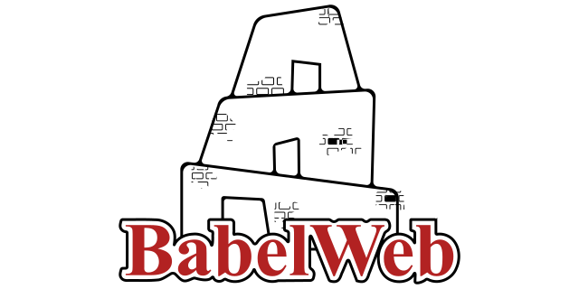

<p align="center">
  
</p>

## 🌐 Available Languages
- [French](docs/README-fr.md)
- [Spanish](docs/README-es.md)

# BabelWeb
**A polyglot browser for a liberated Web.** Why should JavaScript be the only language allowed in the browser? BabelWeb offers a multi-runtime architecture where Python, C#, Rust, and many others can coexist, interact with the DOM, and offer true freedom to developers.

## Goals

- Allow each website to choose its runtime language
- Integrate secure runtimes (Python, C#, Rust, etc.) into the browser
- Expose the DOM via typed bindings for each language
- Maintain compatibility with existing sites
- Create a modular, extensible, and secure architecture

## Join the movement

This project is a technological utopia—but every revolution begins with an idea.

Contributors, researchers, dreamers: your ideas, your critiques, and your lines of code are welcome.

## License

MIT—free, open, and unconstrained.

## Contribute

Fork, propose ideas, open issues.

Even a comment can move the revolution forward.

## What it could look like: :smiling_face_with_three_hearts:
```html
<html>
<meta runtime="python" /> <!-- and the dream begins  -->
</html>
```
