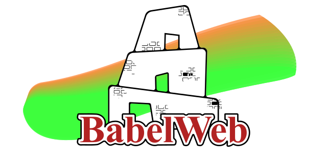

<p align="center">
  
  <p align="center">
    <strong style="font-size: 54px">
      Para navegador políglota para una web liberada.
    </strong>
  </p>
</p>

## 🌐 Idiomas disponibles
- [Inglés](../README.md)
- [Francés](README-fr.md)

# BabelWeb
¿Por qué debería ser JavaScript el único lenguaje permitido en el navegador? BabelWeb ofrece una arquitectura multi-runtime donde Python, C#, Rust y muchos otros pueden coexistir, interactuar con el DOM y ofrecer verdadera libertad a los desarrolladores.

## Objetivos

- Permitir que cada sitio web elija su lenguaje de ejecución
- Integrar entornos de ejecución seguros (Python, C#, Rust, etc.) en el navegador
- Exponer el DOM mediante enlaces tipados para cada lenguaje
- Mantener la compatibilidad con sitios web existentes
- Crear una arquitectura modular, extensible y segura

## Únete al movimiento

Este proyecto es una utopía tecnológica, pero toda revolución comienza con una idea.

Colaboradores, investigadores, soñadores: sus ideas, críticas y líneas de código son bienvenidas.

## Licencia

MIT: libre, abierta y sin restricciones.

## Contribuye

Bifurca, propone ideas, abre problemas.

Incluso un comentario puede impulsar la revolución.

## Cómo podría ser: :smiling_face_with_three_hearts:
```html
<html>
<meta runtime="python" /> <!-- y el sueño comienza -->
</html>
```
